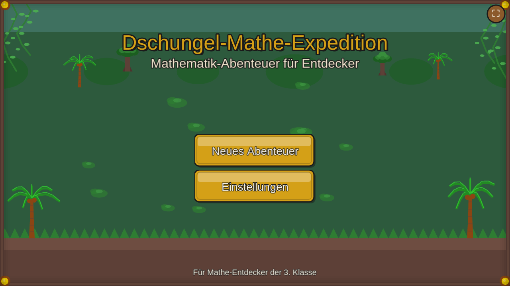
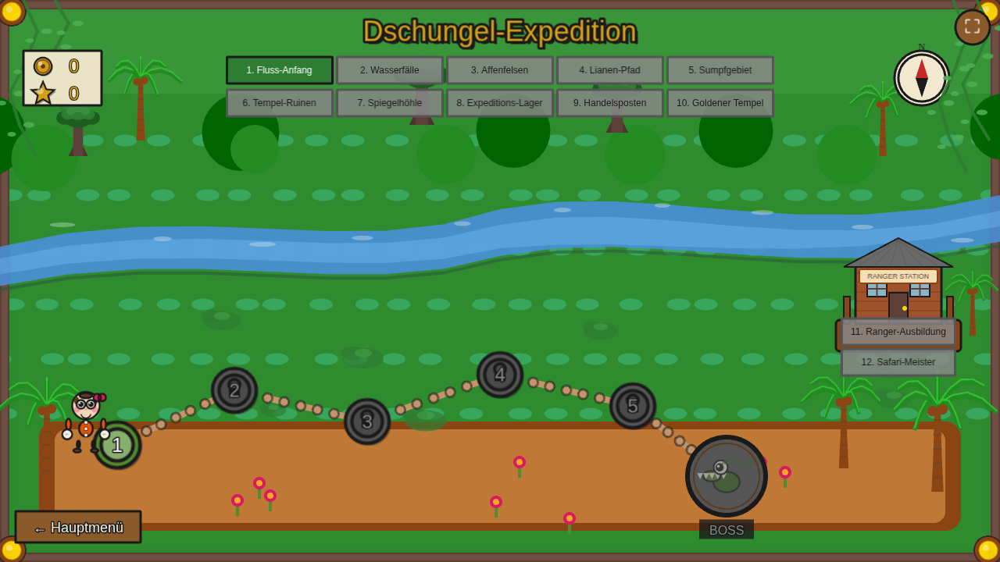
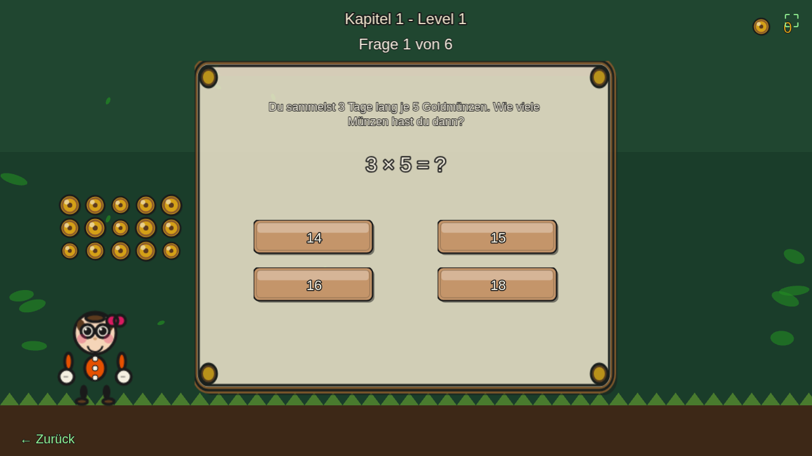

# Dschungel-Mathe-Expedition

Ein interaktives Mathe-Lernspiel für Grundschüler der 3. Klasse, basierend auf dem bayerischen Lehrplan.


## Screenshots

| Hauptmenü | Weltkarte |
|-----------|-----------|
|  |  |

| Level-Ansicht |
|---------------|
|  |

## Features

- **12 Kapitel** mit je 5 Leveln und Bossgegner
  - 10 Dschungel-Kapitel (3. Klasse)
  - 2 Ranger-Station Bonus-Kapitel (4. Klasse Vorschau)
- **Cuphead-inspirierte Grafik** im 1930er Cartoon-Stil
- **Multi-Profil System** für mehrere Spieler
- **Fortschrittsspeicherung** im Browser (localStorage)

## Lerninhalt (Bayerischer Lehrplan 3. Klasse)

| Kapitel | Thema |
|---------|-------|
| 1-2 | Einmaleins (1-5, 6-10) |
| 3 | Division |
| 4-5 | Addition & Subtraktion bis 1000 |
| 6-7 | Geometrie (Formen, Symmetrie, Körper) |
| 8 | Längen messen (cm, m, km) |
| 9 | Zeit & Geld |
| 10 | Textaufgaben |
| 11-12 | Bonus: 4. Klasse Vorschau |

## Installation

```bash
# Repository klonen
git clone https://github.com/smtws/mathe-spiel-klasse-3-bayern.git
cd mathe-spiel-klasse-3-bayern

# Abhängigkeiten installieren
npm install

# Entwicklungsserver starten
npm run dev

# Produktions-Build erstellen
npm run build
```

## Technologie

- **[Phaser 3](https://phaser.io/)** - Game Framework
- **[Vite](https://vitejs.dev/)** - Build Tool
- **Vanilla JavaScript** - Keine zusätzlichen Frameworks

## Projektstruktur

```
src/
├── scenes/          # Phaser Szenen (Menu, WorldMap, Level, Boss)
├── managers/        # Save, Question, Celebration Manager
├── questions/       # Fragegeneratoren pro Themengebiet
├── animations/      # Hintergrund-Animationen
├── utils/           # Hilfsfunktionen (Grafik, Erklärungen)
└── config.js        # Spielkonstanten und Styles
```

## Lizenz

MIT License - siehe [LICENSE](LICENSE)

---

Entwickelt für kleine Mathe-Entdecker 🌴🧮
